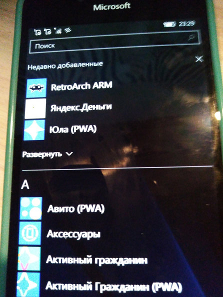
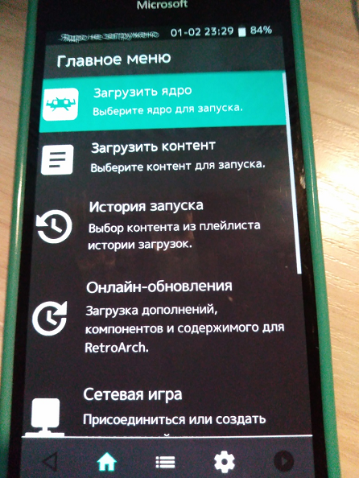

   
  <b>RetroArch ARM UWP/WOA release</b> 
  <a href="./cores">Cores</a> |
  <a href="https://forum.xda-developers.com/t/retroarch-uwp-arm-release-n64-scummvm-and-more.4411251/">XDA Article</a> |
  <a href="https://github.com/libretro/RetroArch">Project</a> 
    
    

# About / Abstract
- This is [RetroArch for Windows (ARM) devices](https://github.com/basharast/RetroArch-ARM).
- With more than 70+ core! 
- I forked this/that release for my own RnD.

## Screenshots

# Target
- It should work with Build: 15035+ (14393 with few cores)
- ARM (special for W10M))))

# UWP improvements
- This app supported by [UWP2Win32](https://github.com/basharast/UWP2Win32)

## My 2 cents
In my VS 2022 Preview, the solution failed to/on build (compile)... and I recovered this/that process 
a little:) 

## How to "deploy/assemble" this "project hell" :)
- Find src/pkg/msvc-uwp/RetroArch-msvc2019-UWP.sln file.
- Open it with VS 2022 Preview. Switch solution onto Debug mode. Choose ARM target.
- Locate RetroArch-msvc2019-UWP and choose Publish, then create RetroArch-msvc2019-UWP_1.10.6.0_arm_Debug.appxbundle
- Test the result on your Lumia "flagman" (i.e., Lumia 950 / 950XL or similar) ! :)

# Future
- Help me add Dynarec for Flycast: [GitHub Issue here](https://github.com/flyinghead/flycast/issues/545)
- Help me to solve N64 issue: [GitHub Issue here](https://github.com/mupen64plus/mupen64plus-video-rice/issues/102)

# Credits
- <a href="https://www.retroarch.com/">RetroArch</a> Developed by RetroArch Team 
- [Bashar Astifan](https://github.com/basharast/) (UWP Improvements and ARM support)
- [Gustave Monce](https://github.com/gus33000) (DLL dynamic loading solution)

# Support - RetroArch Team
RetroArch Team done greate job to make this project if you would like to support 
them <a href="https://www.retroarch.com/index.php?page=donate">Click Here</a>

# Note
I'm not affiliate with RetroArch or Libretro 

## ..
AS IS :: No my support :: Devs / RnD only ::  DIY !  

## .
[m][e] February 2, 2023
