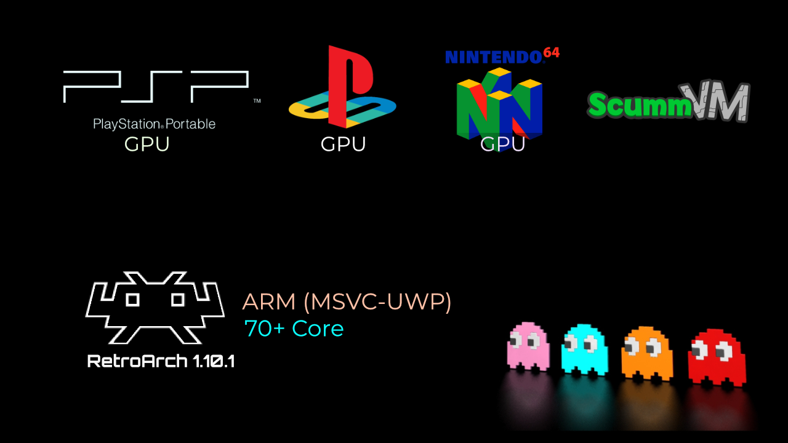

   
  <b>RetroArch ARM UWP release</b> 
  <a href="./cores">Cores</a> |
  <a href="./src">Source</a> |
  <a href="https://github.com/libretro/RetroArch">RetroArch Project</a> 
    
    

# About

After long time of work I present to you this release of RetroArch for Windows (ARM) devices

With more than 70+ core, Cores are compiled for MSVC ARM (UWP), some of them worked on WOA release

Including N64 core with Hardware render (Which is very rare)

# Improvements

This release contains the latest ANGLE library (by Google) that used to make OpenGL ES supported

Also I made many improvements for UWP functions,

and reverted back the uncompatbile functions for the lower builds.

# New Cores
- N64 
- ScummVM 2.6.0
- SEGA Dreamcast
- PPSSPP
- PSX HW GPU
- OpenLara (Tomb Rider)
- Commodore Series (64 , C128, CBM-II..etc)
- NeoGeo CD
- Amstrad CPC
- Game & Watch
- Jump 'n Bump
- Sinclair ZX81
- Mattel Intellivision
- Mac II

# Downloads

- RetroArch UWP 1.10.1 (Latest as per Mar. 4, 2022)

- Cores are included

# Target

It should work with Build: 15063+ (14393 with few cores)

# Future

- Help me add Dynarec for Flycast: [GitHub Issue here](https://github.com/flyinghead/flycast/issues/545)

- Help me to solve N64 issue: [GitHub Issue here](https://github.com/mupen64plus/mupen64plus-video-rice/issues/102)

# Credits

<a href="https://www.retroarch.com/">RetroArch</a> Developed by RetroArch Team 

Thanks for <a href="https://www.libretro.com/">Libretro</a> to provide this solution to use the cores in one platform

UWP enhancements and cores compiling Bashar Astifan

# Support

RetroArch Team done greate job to make this project if you would like to support them <a href="https://www.retroarch.com/index.php?page=donate">Click Here</a>

Yo can also help me to keep this kind of projects a live by supporting my projects like:

- <a href="https://github.com/basharast/wut">W.U.T</a>

- <a href="https://github.com/basharast/AstifanSystem">Astifan System</a>

# Note

I'm not affiliate with RetroArch or Libretro